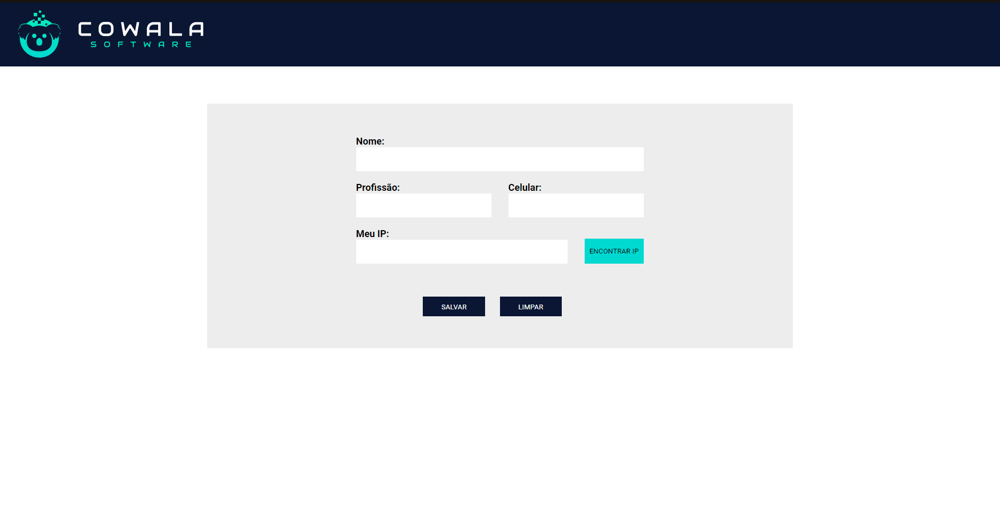

<h1 align="center">
Desafio cowala frontend
</h1>

 

Ao clicar em encontrar ip, o ip é preenchido automaticamente.

## Tecnologias

Esse projeto foi desenvolvido com as seguintes tecnologias:

- [React](https://reactjs.org/)
- [Typescript](https://www.typescriptlang.org)
- [styled-components](https://styled-components.com)

## Projeto

Esse projeto é uma aplicação frontend requerida no desafio ca empresa cowala, onde dados são informados e salvos localmente caso desejado.

## Observações

- Para instalar todas as dependências utilizadas no projeto basta rodar o comando `yarn`
- O servidor pode ser iniciado com `yarn start`, onde se tem acesso pelo [`localhost:3000`](http://localhost:3000/) no navegador.
